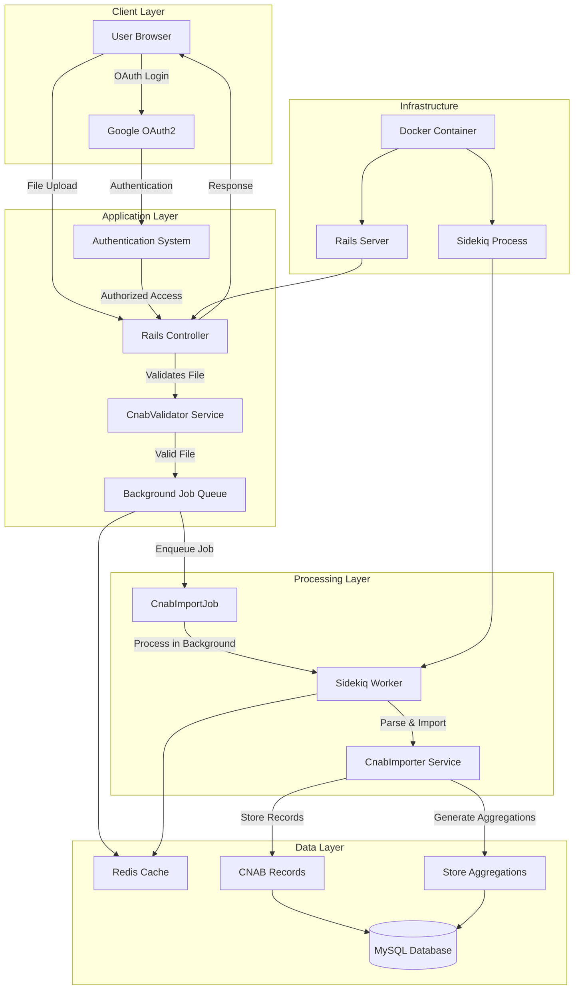
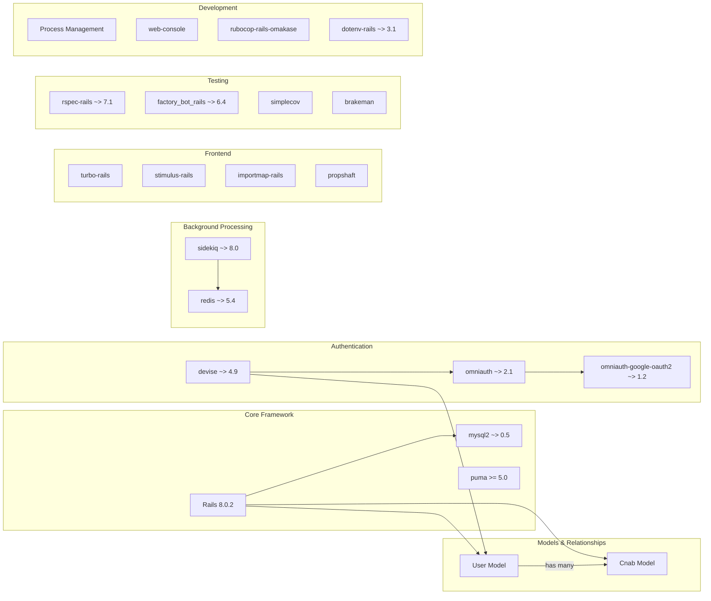
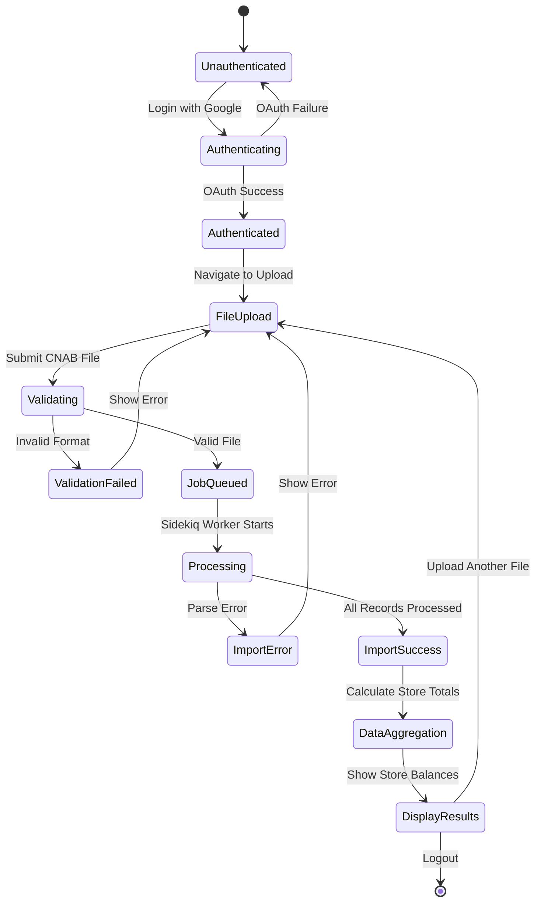
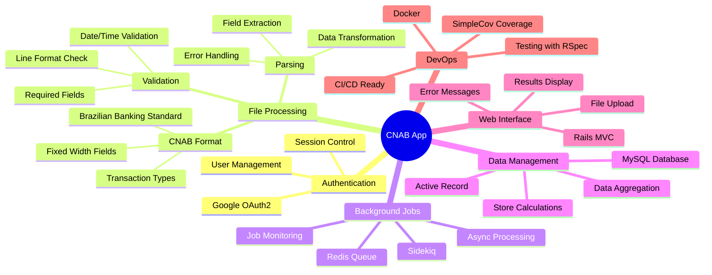

# **CNAB App**

[Homepage](https://github.com/enogrob/cnab_app)


## Contents

- [Summary](#summary)
- [Architecture](#architecture)
  - [Key Concepts](#key-concepts)
- [Tech Stack](#tech-stack)
- [Getting Started](#getting-started)
- [Usage Examples](#usage-examples)
- [Contributing Guidelines](#contributing-guidelines)
- [Troubleshooting](#troubleshooting)
- [License](#license)
- [References](#references)

## Summary

The CNAB App is a Ruby on Rails REST API application designed to process and normalize CNAB (Centro Nacional de Automação Bancária) data files, providing aggregated financial transaction data for stores. CNAB is a standardized file format used by Brazilian banking institutions for electronic data interchange, containing transaction records with fixed-width fields that represent various types of financial operations.

This application serves as a comprehensive solution for handling CNAB file uploads, validation, processing, and data aggregation. It implements asynchronous background processing using Sidekiq and Redis to ensure responsive performance when dealing with large transaction files. The system provides user authentication via Google OAuth2, validates CNAB file structure according to Brazilian banking standards, and generates meaningful financial reports for store owners.

The project demonstrates modern Ruby on Rails development practices including service-oriented architecture, background job processing, comprehensive testing with RSpec, and containerization with Docker. It's particularly valuable for businesses that need to process point-of-sale transaction data from Brazilian payment systems and generate financial insights from CNAB format files.

## Architecture



<details>
<summary><strong>1. Gems Dependency Diagram - Dependencies and Models</strong> (Click to expand)</summary>



</details>

<details>
<summary><strong>2. Journey Process - State Transitions</strong> (Click to expand)</summary>



</details>

<details>
<summary><strong>3. Mind Map - Interconnected Themes</strong> (Click to expand)</summary>



</details>

### Key Concepts

* **CNAB Format**: Centro Nacional de Automação Bancária - A standardized fixed-width file format used by Brazilian financial institutions for electronic data interchange, containing transaction records with specific field positions and lengths
* **Transaction Types**: Different categories of financial operations (1-9) that determine whether a transaction represents income (entrada) or expense (saída) for a store
* **Background Processing**: Asynchronous job execution using Sidekiq and Redis to handle time-intensive file parsing without blocking the web interface
* **Service-Oriented Architecture**: Clean separation of concerns using dedicated service classes for validation (CnabValidator) and import operations (CnabImporter)
* **Data Aggregation**: Automatic calculation of store balances by summing transaction values based on their types (positive for income, negative for expenses)
* **OAuth2 Authentication**: Secure user authentication via Google OAuth2 integration, eliminating the need for traditional username/password management
* **Fixed-Width Parsing**: Specialized parsing logic that extracts data from predetermined character positions within each line of the CNAB file
* **Transaction Validation**: Multi-layered validation ensuring file format compliance, required field presence, and proper date/time formatting
* **Store Balance Calculation**: Smart aggregation logic that applies different mathematical operations based on transaction types to compute accurate store financial positions

## Tech Stack

* **Programming Language**: Ruby 3.3.2 with modern syntax and performance optimizations
* **Framework**: Ruby on Rails 8.0.2 - Full-stack web application framework with MVC architecture
* **Database**: MySQL 8.0 - Relational database for persistent storage of CNAB records and user data
* **Background Processing**: Sidekiq 8.0 - Multi-threaded background job processing with Redis-based queue management
* **Caching**: Redis 5.4 - In-memory data structure store for job queues and caching
* **Authentication**: 
  - Devise 4.9 - Flexible authentication solution for Rails
  - OmniAuth 2.1 - Multi-provider authentication framework
  - OmniAuth Google OAuth2 1.2 - Google authentication strategy
* **Testing Framework**: 
  - RSpec Rails 7.1 - Behavior-driven development framework
  - Factory Bot Rails 6.4 - Test data generation
  - SimpleCov - Code coverage analysis
* **Build Tools**: 
  - Bundler - Dependency management
  - Propshaft - Modern asset pipeline
  - Importmap Rails - JavaScript import maps
* **Web Server**: Puma 5.0+ - Multi-threaded Ruby web server
* **Frontend**: 
  - Turbo Rails - SPA-like page acceleration
  - Stimulus Rails - JavaScript framework
  - Jbuilder - JSON API builder
* **Development Tools**: 
  - Foreman - Process management
  - Web Console - In-browser debugging
  - Rubocop Rails Omakase - Code style enforcement
  - Brakeman - Security vulnerability scanner
* **Deployment**: 
  - Docker - Containerization platform
  - Docker Compose - Multi-container orchestration
  - Kamal - Deployment automation
  - Thruster - HTTP caching and compression
* **Environment Management**: 
  - dotenv-rails 3.1 - Environment variable loading
  - ASDF - Runtime version management
* **Version Control**: Git with GitHub hosting and collaborative development workflows
* **Documentation**: Mermaid - Diagram generation for architecture visualization

## Getting Started

### System Requirements

* **Ruby**: 3.3.2 (managed via ASDF)
* **Node.js**: 23.2.0 (managed via ASDF)
* **Rails**: 8.0.2
* **MySQL**: 8.0+
* **Redis**: 5.4+
* **Docker**: Latest version (optional)

### Installation

1. **Install ASDF and runtime dependencies**:
```bash
brew install asdf
echo 'export PATH="${ASDF_DATA_DIR:-$HOME/.asdf}/shims:$PATH"' >> $HOME/.zshrc
mkdir -p "${ASDF_DATA_DIR:-$HOME/.asdf}/completions"
asdf completion zsh > "${ASDF_DATA_DIR:-$HOME/.asdf}/completions/_asdf"
source $HOME/.zshrc
```

2. **Install Ruby and Node.js**:
```bash
asdf plugin add ruby
asdf plugin add nodejs https://github.com/asdf-vm/asdf-nodejs.git
asdf install nodejs 23.2.0
asdf install ruby 3.3.2
asdf global nodejs 23.2.0
asdf global ruby 3.3.2
```

3. **Install Rails and Foreman**:
```bash
gem install rails -v '8.0.2'
gem install foreman
```

4. **Install supporting services**:
```bash
brew install redis mysql
brew services start redis
brew services start mysql
```

5. **Clone and setup the project**:
```bash
git clone git@github.com:enogrob/cnab_app.git
cd cnab_app
bundle install
rails db:migrate
```

### Configuration

1. **Environment variables** (create `.env` file):
```env
GOOGLE_CLIENT_ID=your_google_client_id
GOOGLE_CLIENT_SECRET=your_google_client_secret
REDIS_URL=redis://localhost:6379/0
```

2. **Database setup**:
```bash
rails db:create
rails db:migrate
```

### Running the Application

**Option 1: Local Development**
```bash
foreman start -f Procfile.dev
# Open browser to http://127.0.0.1:3000
```

**Option 2: Docker Compose**
```bash
docker-compose up --build
docker-compose run web bin/rails db:migrate
# Open browser to http://127.0.0.1:3000
```

## Usage Examples

### 1. File Upload and Processing

**Upload a CNAB file via web interface**:
1. Navigate to the application homepage
2. Authenticate using Google OAuth2
3. Click "Upload CNAB File"
4. Select a valid CNAB format file
5. Click "Import" to process the file

**CNAB File Format Example**:
```
1201908300000010000000000000000000000000000000000000000000000000000000000000000000000JOSÉ CARLOS     PADARIA DO ZÉ BATISTA
```

### 2. API Endpoints

**View aggregated store data**:
```bash
# After authentication, visit the stores index
GET /cnabs
# Returns aggregated balance data for all stores
```

**Upload new CNAB file**:
```bash
# POST request to upload endpoint
POST /cnabs
Content-Type: multipart/form-data
# Include file in request body
```

### 3. Background Job Monitoring

**Check job status via Rails console**:
```ruby
rails console
# Check queued jobs
Sidekiq::Queue.new.size
# Check processed jobs
Sidekiq::ProcessSet.new.size
```

### 4. Data Aggregation Results

**Example store balance output**:
```
Store Name: PADARIA DO ZÉ BATISTA
Balance: R$ 2,450.00
Transactions: 15 total
```

### 5. Testing the Application

**Run the complete test suite**:
```bash
bundle exec rspec
# Generates coverage report in coverage/index.html
```

**View test coverage**:
```bash
open coverage/index.html
```

## Contributing Guidelines

### Development Workflow

1. **Fork the repository** and clone your fork
2. **Create a feature branch** from main:
   ```bash
   git checkout -b feature/your-feature-name
   ```
3. **Make your changes** following the coding standards
4. **Write tests** for new functionality
5. **Run the test suite** to ensure nothing is broken:
   ```bash
   bundle exec rspec
   ```
6. **Check code style** with RuboCop:
   ```bash
   bundle exec rubocop
   ```
7. **Submit a pull request** with a clear description

### Coding Standards

* Follow **Ruby Style Guide** and Rails conventions
* Use **RuboCop Rails Omakase** configuration
* Maintain **test coverage** above 80%
* Write **descriptive commit messages**
* Include **RSpec tests** for all new features
* Use **service objects** for complex business logic

### Testing Requirements

* Write unit tests for all models and services
* Include integration tests for controllers
* Test both happy path and error scenarios
* Use Factory Bot for test data generation
* Maintain SimpleCov coverage reporting

### Security Considerations

* Run **Brakeman** security scans before submitting PRs
* Validate all file uploads and user inputs
* Follow Rails security best practices
* Keep dependencies updated for security patches

## Troubleshooting

### Common Issues

**Q: Job queue is not processing files**
A: Check Redis connection and restart Sidekiq:
```bash
redis-cli ping
# Should return PONG
bundle exec sidekiq
```

**Q: File upload fails with validation errors**
A: Ensure CNAB file format is correct:
- Each line must be exactly 81 characters
- Date format: YYYYMMDD
- Time format: HHMMSS
- All required fields must be present

**Q: Database connection errors**
A: Verify MySQL is running and credentials are correct:
```bash
brew services list | grep mysql
# Check database.yml configuration
```

**Q: Google OAuth authentication fails**
A: Check environment variables and Google Console configuration:
- Verify GOOGLE_CLIENT_ID and GOOGLE_CLIENT_SECRET
- Ensure redirect URIs are properly configured
- Check OAuth consent screen settings

### Debugging Tips

* Check Rails logs: `tail -f log/development.log`
* Monitor Sidekiq web interface: Add `require 'sidekiq/web'` to routes
* Use Rails console for data inspection: `rails console`
* Review test failures with verbose output: `bundle exec rspec --format documentation`

### Performance Issues

* Monitor Redis memory usage: `redis-cli info memory`
* Check database query performance with `rails db:analyze`
* Use Rails performance monitoring tools
* Optimize background job processing with proper queue management

## License

This project is available under the MIT License. See the project repository for full license details.

## References

* [CNAB App Repository](https://github.com/enogrob/cnab_app) - Main project repository and source code
* [Ruby on Rails Guides](https://guides.rubyonrails.org/) - Official Rails documentation and best practices
* [Sidekiq Documentation](https://github.com/sidekiq/sidekiq/wiki) - Background job processing framework
* [RSpec Documentation](https://rspec.info/documentation/) - Behavior-driven development testing framework
* [Devise Documentation](https://github.com/heartcombo/devise) - Authentication solution for Rails applications
* [FEBRABAN](https://www.febraban.org.br/) - Brazilian Federation of Banks, CNAB format authority
* [Google OAuth2 Documentation](https://developers.google.com/identity/protocols/oauth2) - OAuth2 implementation guide
* [Docker Documentation](https://docs.docker.com/) - Containerization platform documentation
* [Redis Documentation](https://redis.io/docs/latest/) - In-memory data structure store
* [MySQL Documentation](https://dev.mysql.com/doc/) - Relational database management system
* [SimpleCov GitHub Repository](https://github.com/simplecov-ruby/simplecov) - Code coverage analysis tool
* [Mermaid Documentation](https://mermaid.js.org/intro/) - Diagram generation for architecture visualization

